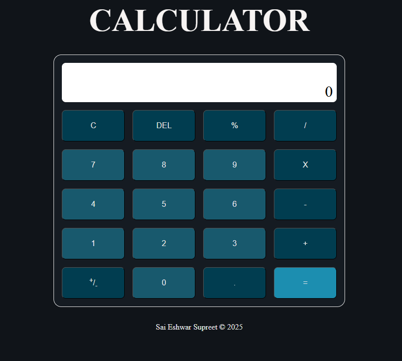

# web-calculator

A browser-based calculator built with **vanilla HTML, CSS, and JavaScript**.  
The app supports both mouse and keyboard input, handles common arithmetic operations, and manages edge cases through explicit state-driven logic — all without external libraries.

## Live Demo

[View on GitHub Pages](https://sai-eshwar-supreet.github.io/web-calculator/)

## Preview

## Features
- Basic arithmetic operations
  - Addition (`+`)
  - Subtraction (`-`)
  - Multiplication (`×`)
  - Division (`÷`)
  - Modulo (`%`)
- Decimal input with validation
- Operator chaining
- Sign toggle (`±`)
- Delete (`DEL`) and clear (`C`)
- Graceful error handling for invalid operations
- Mouse and keyboard input support

## Keyboard Controls
- Numbers: `0–9`
- Decimal: `.`
- Operators: `+  -  *  /  %`
- Equals: `=` or `Enter`
- Clear: `Escape`
- Delete: `Backspace`
- Sign toggle: `Alt + -` or `Alt + +`

## What I Practiced
- Managing application state with a single explicit state object
- Centralizing arithmetic logic using a lookup table (`OPERATIONS`)
- Unifying mouse and keyboard input under the same state rules
- Event delegation for efficient input handling
- Separating application logic from DOM rendering

## Technical Notes
- State management
  - Calculator behavior is driven by a centralized state object (`operand1`, `operand2`, `operator`, `display`, `error`)
  - State transitions are explicit and intentional
- Operations handling
  - Arithmetic operations return structured responses instead of throwing errors
  - Invalid operations transition the calculator into an error state
- Input handling
  - Mouse clicks and keyboard input are treated as equivalent sources of user actions
  - Both input methods respect the same error-handling and state-transition rules
- Rendering
  - UI is updated through a dedicated render function
  - Display output is derived directly from state

## Acknowledgements
This project was completed as part of  
**[The Odin Project – Foundations Course](https://www.theodinproject.com/)**

